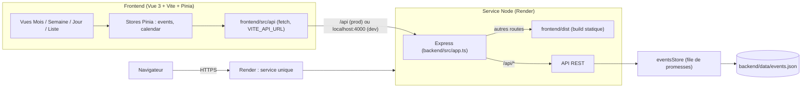
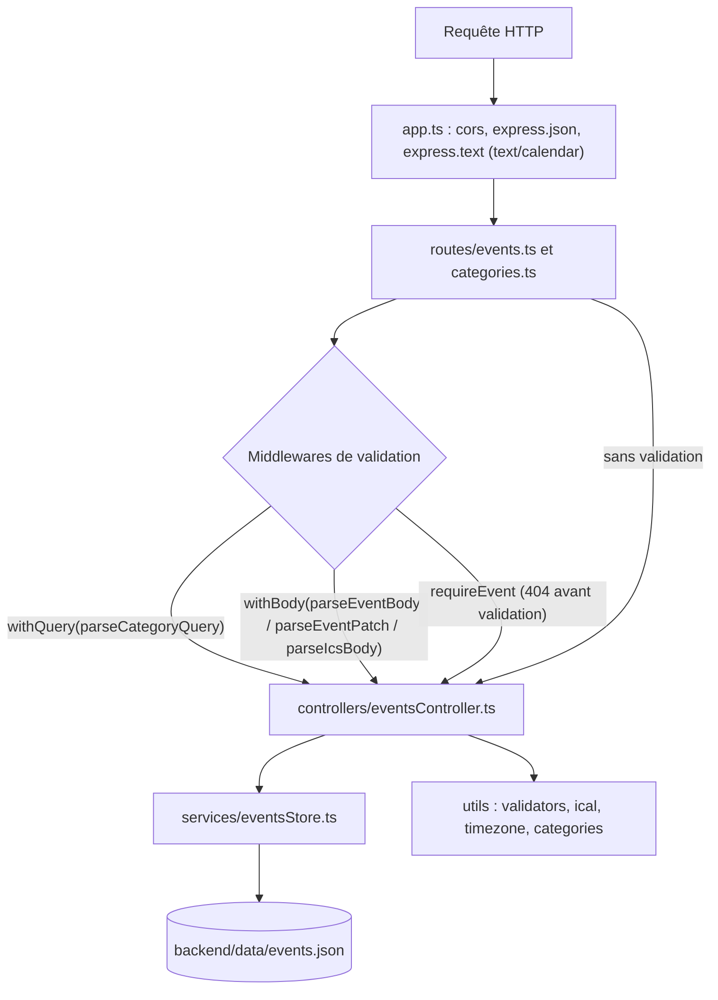
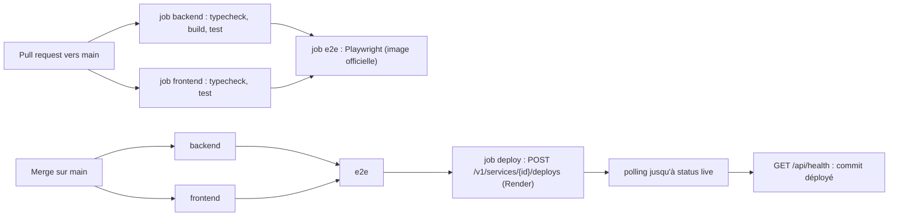

# Architecture

Exports PDF : [vue d'ensemble](architecture-overview.pdf), [couches backend](architecture-layers.pdf), [CI/CD](architecture-ci.pdf).

Vue d'ensemble du système : frontend Vue 3, API Express, stockage JSON, et déploiement Render (un seul service).

## Vue d'ensemble

## Backend : couches

## Déploiement et CI

## Lecture

- Une seule URL en prod : Express sert l'API et le build frontend.
- `events.json` : pas de base de données. Sur le plan gratuit Render, le disque n'est pas persistant.
- Les règles de couche (routes, controllers, services, validation à la frontière) sont dans `CLAUDE.md` et `.claude/rules/backend.md`.
