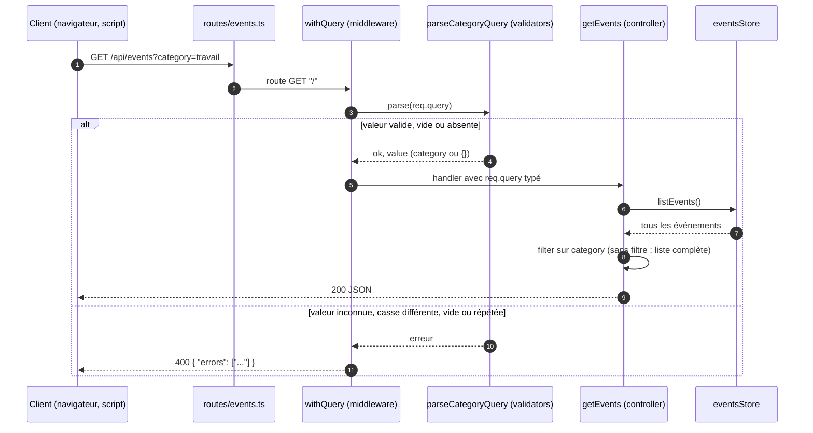

# Séquence : filtre par catégorie

Requête `GET /api/events?category=<id>` (feature `001-events-category-filter`, PR #84).

## Règles

- Valeurs admises : `personnel`, `travail`, `important`, `famille`, `loisirs`, `autre` (`CATEGORY_IDS`).
- Sans paramètre : même contenu et même ordre qu'avant.
- Événement sans catégorie stockée : rattaché à `autre`.
