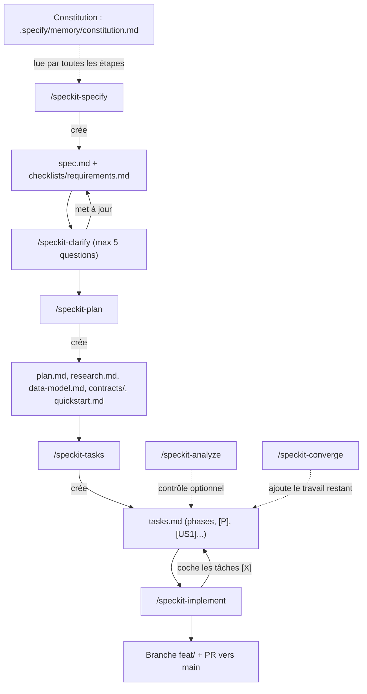

# Workflow spec-kit

Export PDF : [spec-kit-workflow.pdf](spec-kit-workflow.pdf).

Cycle de vie d'une feature avec spec-kit (`.specify/`, skills `speckit-*`). Chaque étape produit un artefact dans `specs/<NNN>-<nom>/`.

## Points de contrôle

| Étape | Porte d'entrée | Sortie |
|---|---|---|
| specify | description libre | spec validée contre la checklist (pas de `[NEEDS CLARIFICATION]` restant) |
| clarify | spec avec ambiguïtés | réponses intégrées dans `## Clarifications` |
| plan | spec clarifiée | Constitution Check PASS |
| tasks | plan et contrats | tâches numérotées, groupées par user story |
| implement | checklists cochées | toutes les tâches `[X]`, tests et typecheck verts |

Les règles de passage avec `/impeccable shape` (features UI) sont dans `CLAUDE.md`, section « Design et agents ».
